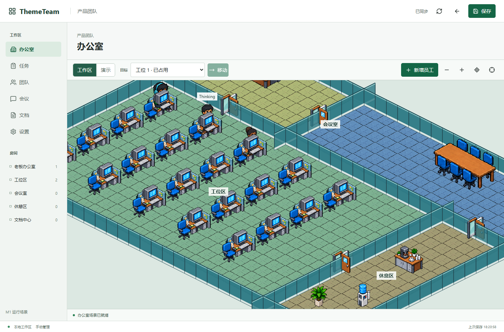

# ThemeTeam

ThemeTeam is a local-first workspace for managing AI agents through a Theme Hospital-inspired office canvas. Employees, rooms, desks, task state, runtime profiles, project directories, and controlled CLI execution are connected through a loopback API.



## Current Status

- Office canvas: 20 workstation seats, 6 meeting seats, isometric map, selection, movement preview, occlusion, and responsive camera controls.
- Default office overview: **100%**. Manual zoom range: 50%–200%.
- P4 dispatcher: queued/running/succeeded/failed/cancelled/timed_out/interrupted, cancellation, timeout, retry, recovery, and artifact isolation.
- Codex CLI: read-only probe and controlled workspace-write task boundary.
- Claude Code/OpenCode: shared adapter contract implemented; local executable smoke remains pending when those CLIs are available.
- P5: overflow-room assignment and `Unplaced` status implemented; full map reflow and 21/40/60-person performance acceptance remain pending.
- M1 G4/G5/G6/G7: intentionally remain pending for QA, project-owner approval, release approval, rollback confirmation, and final human sign-off.

## Run Locally

```powershell
# API
python run.py --host 127.0.0.1 --port 8000 --no-open

# Frontend
cd frontend
npm install
npm run dev
```

Open [http://127.0.0.1:5173/](http://127.0.0.1:5173/).

The API is loopback-only. Runtime profiles and project-directory profiles are stored in the local settings store, not as the sole source of the workspace snapshot. Credentials are never stored in the workspace, logs, or README.

## Verification

```powershell
python tests/run_isolated.py --rounds 2

cd frontend
npm run typecheck
npm run test:unit
npm run build
npm run verify
```

The development reports are in `.ai-spec/iterations/ITER-2026-001/05-testing/`, including the P4/P5 implementation report and CLI adapter evidence.

## Repository Guide

- `frontend/`: React, Zustand, Phaser, and EasyStar office application.
- `themeteam/core/`: workspace models, persistence, settings store, dispatcher, and runtime adapters.
- `themeteam/web/`: loopback API and local static server.
- `tests/`: backend isolation, security, dispatcher, and CLI smoke tests.
- `docs/`: architecture, design decisions, acceptance criteria, and evidence.
- `projects/`: generated example projects, including the Bazi prediction demo.

## License

This project is released under the MIT License. See [LICENSE](LICENSE).
