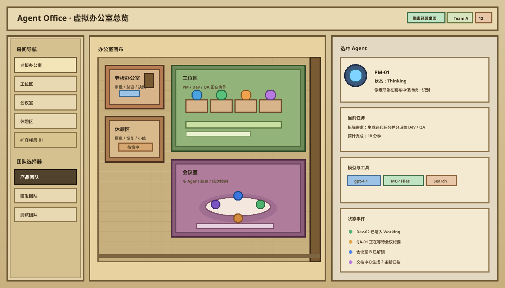

# Agent Office 管理应用设计方案

版本：v1.2（2026-09-08，《主题医院》风格基准已确认）

本文描述目标系统，不描述当前完成度。现状以 [全仓进展核验](progress-assessment.md) 为准；办公室细化与方案输入评审以 [office-canvas.md](office-canvas.md) 为准；验收范围见 [requirements.md 第 10 节](requirements.md#10-办公室迭代需求确认包)。新增选型/契约尚待需求确认与技术验证，不能视为已冻结的实施设计。

## 1. 设计目标

本设计方案基于需求分析文档，进一步明确系统架构、模块边界、数据模型、交互规则与实现优先级。设计重点是把“办公室经营模拟”这一表达方式转化为可维护的业务系统，而不是仅做一个好看的动画外壳。

办公室画布 UI、视觉与交互以用户已确认的游戏《主题医院》为主要参考：固定等轴测的连续建筑、半高墙与门洞、家具定义房间用途、独立人物经走廊移动并入座工作、对象选中与局部状态反馈。不能以平面房间卡片、静态插画或抽象人物标签替代该体验。美术资源原创或合法授权，不直接复用原游戏素材。

设计图和实现统一遵循 [办公室专项方案](office-canvas.md) 第 1.1-1.3 节的 TH-01 至 TH-06 标准与 VIS-01 至 VIS-05 交付要求。参考方向已确认，不等于当前历史 SVG、新版视觉稿或正式技术设计已经验收。

## 2. 总体架构

### 2.1 分层结构

- 表现层：Web 前端，负责虚拟办公室画布、侧边面板、任务看板、文档中心和模型配置。
- 应用层：API 服务与实时事件层，负责 CRUD、事件广播、状态同步和权限控制。
- 编排层：多 Agent 工作流、会议图、任务拆解、审批控制。
- 数据层：SQLite、文件系统、向量库和审计日志。
- 集成层：LLM Provider、MCP 工具、Python 沙盒、本地模型和文件系统工具。

### 2.2 推荐技术栈

- 前端候选：React + TypeScript + Zustand 管理 DOM 与客户端选择；Phaser 管理等轴测地图、Sprite、Camera、Tween。替换旧 PixiJS 建议，但先完成锁定版本的资产/性能/许可证 PoC 再冻结。
- 后端：FastAPI 作为主 API 服务，Python worker 处理长任务与 Agent 编排。
- 实时通信：HTTP 命令 + 单个 WebSocket 增量订阅；文本与离散事件分类型处理。SSE 仅作为后续有明确收益的单向流替代，不默认启用两套权威流。
- 存储：SQLite 负责结构化数据，文件系统负责文档与资产，ChromaDB 负责向量检索。
- 编排：LangGraph 作为主工作流引擎，保留对其他编排引擎的适配空间。
- 打包：后续采用 Tauri 或 Electron 封装桌面客户端。

### 2.3 关键设计优化

- 业务后端统一，不并行维护 FastAPI 与 Node.js 两套业务逻辑。
- `MCP` 与执行沙盒分离，前者负责工具接入，后者负责权限与隔离。
- `Mem0` 仅承担记忆提取、压缩与建议，不替代主存储。
- “2.5D” 实现为等距 2D 场景与分层动画，降低美术与性能成本。
- 每个 Agent 都应有可复用的人物资源包，至少包含站立、行走、工作、思考、对话、会议、入座、阻塞等状态。
- Leader 是权限角色，不是天然“更强”的 Agent；晋升只影响任务分发和会议权能。
- 当前 `http.server + JSON + 原生 JS/SVG` 只作为迁移基线；复用实体 ID、JSON 导入与已有效的行为测试，不把 SVG 字符串渲染或全局 STORE 当长期架构。
- 增加领域服务、持久化仓储、事件 outbox、模型适配器、运行记录与审批边界。单进程/单 worker 起步，不为首个本地版本引入微服务或外部消息集群。
- SQLite 是领域事实来源；向量检索、场景动画和提取记忆是可重建投影。API Key 使用系统密钥库/加密引用，不返回浏览器；MCP 工具也必须经过权限和副作用审计。

## 3. 信息架构与页面结构

### 3.1 主界面布局

- 中央：虚拟办公室画布，承载房间、Agent、气泡、灯光、路径和动效，人物是主要视觉主体，房间是次级结构。
- 左侧：团队与房间导航、筛选器、部门选择器。
- 右侧：上下文详情面板，显示选中 Agent、任务、会议、文档或模型配置。
- 底部：可折叠的看板/聊天/事件工作区，通过标签切换，避免所有模块纵向堆叠挤走画布。
- 顶部：全局状态条，显示当前团队、主题、模型池、告警与同步状态。

### 3.2 页面与视图

- Workspace Overview：办公室总览。
- Agent Directory：Agent 列表与详情。
- Task Board：任务看板。
- Meeting Room：会议与群聊。
- Doc Center：文档中心。
- Model Gateway：全局模型配置。
- Knowledge Base：三层记忆库与搜索。
- Admin & Audit：权限、审批与审计。

## 4. 视觉与交互规范

### 4.1 主题风格

- 像素经营桌面：默认外壳主题，强调老式经营模拟桌面的窗口、边框、色板和信息语气。
- 《主题医院》式等轴测办公室：默认画布基准，强调连续空间、家具用途、遮挡、人物活动和对象交互，不能仅靠配色或阴影表达。
- 现代信息面板：可切换的 DOM 皮肤，不改变办公室拓扑、人物形象/比例和对象交互规则。
- 极简网格：后续高密度替代工作视图，不是默认办公室的验收替代品。

### 4.1.1 视觉基调细则

- 办公区不是静态后台插画，而是可运行的经营模拟空间；人物活动应始终比装饰元素更突出。
- 默认视觉应明显偏老派像素经营桌面，允许保留像素边缘、旧式桌面配色、夸张家具轮廓和略带游戏机时代的质感，但不能牺牲可读性。
- 房间、走廊、门洞、工位和会议桌需要有明确的空间边界，避免把整个办公室做成平铺卡片。
- 在默认主题下，任务板、聊天窗、文档与配置区也应收束到同一套像素桌面语法，只保留足够的文字可读性与交互效率；现代主题下再使用更标准的信息面板语言。
- 同一屏内的主信息层级应保持清楚：人物 > 当前房间 > 任务与状态 > 背景装饰。
- 当多个 Agent 同屏活动时，应优先保持行动轨迹和朝向可辨，而不是追求画面拥挤感。

### 4.1.2 画布视觉规则

- 默认画布采用固定 2:1 等轴测投影，房间通过半高/剖切墙、菱形地砖、门洞、连续走廊和办公家具区分；角色与家具通过统一脚底锚点和遮挡形成体积感，不以平面俯视稿替代。
- 人物形象必须大于普通状态图标，能通过发型、服装、色彩或道具区分角色。
- 每个工位、会议桌、休憩点都应有明确可站立或可坐下的锚点，便于路径规划和动画落位。
- 头顶气泡应短小、状态化，避免遮挡人物或房间标题。
- 默认外壳保持经营模拟桌面气质，办公区画布保持更强的经营模拟游戏气质，两者通过统一色板、状态色和边框语言衔接。

### 4.2.1 办公区 2.5D 交互规则

- 镜头使用固定 2:1 等轴测投影，仅平移/缩放，不提供自由倾角；层级和物体脚底锚点形成空间感。
- 镜头支持平移、缩放、跟随选中 Agent、房间聚焦和一键回到总览。
- 选中房间时，系统应轻推镜头并提升该区域亮度或对比度。
- 拖拽目标前应显示落点预览，包含门洞、工位、会议桌和白板等锚点高亮。
- Agent 移动应遵循房间边界与走廊路径，必要时可显示路径轮廓或地面高亮。
- 当多个 Agent 进入同一区域时，采用合法锚点预留、排队和稳定脚底深度排序；不能通过无依据上浮改变其真实位置。
- 会议、协作和聚集场景应通过人物朝向、前后层级和局部高亮强化“正在发生事情”的感觉。

### 4.2 画布交互

- 单击 Agent：打开详情卡与快捷操作。
- 单击房间：聚焦该空间并高亮 occupant。
- 双击会议室：进入会议视图。
- 拖拽任务到 Agent：发起指派。
- 首版通过明确菜单/表单请求换座与入会；后续拖拽只发同一业务命令，不直接改位置或会议成员。
- 拖拽文件到文档中心：触发归档或注入流程。
- 悬停 Agent：显示状态气泡、当前任务和简要进度。
- 当多个 Agent 协同时，画布中应出现明显的靠近、围站、转向、等待和说话气泡效果。
- 点击空白区域：清除选择但保留相机；返回总览由独立工具触发。
- 右键 Agent：打开角色操作菜单，包括跟随、呼叫、加入会议、临时暂停、查看历史动作。
- 门洞是寻路节点，不是首版直接拖放业务目标；会议桌、白板、工位只接受被授权的动作类型。
- 右键轻点为菜单，右键拖过阈值为平移；中键与空格+主键同样可平移，详见专项手势表。
- 在动画执行中再次点击 Agent：只打开详情，不打断移动；替换目的地、取消任务与取消会议分别使用明确命令。

### 4.3 状态表现

- Idle：待命状态，灯光柔和。
- Walking：移动中，沿走廊或房间内路径前往目标工位、会议桌或协作对象。
- Working：执行中，工位有节奏性动画，角色应保持面向工作对象。
- Thinking：思考中，出现思考气泡或节奏变化，角色可轻微停步或驻足。
- Talking：交流中，角色需转向对话对象并显示头顶气泡。
- In-Meeting：会议中，移动至会议室并显示群聊气泡。
- Sitting：入座状态，角色需与工位或会议桌位置对齐。
- Blocked：被阻塞，提示原因和处理建议。
- Offline：不可用或暂停。

### 4.3.1 人物形象规则

- 每个 Agent 的人物形象应能在远视距离下通过轮廓、主色和配件完成基础识别。
- 人物形象至少应有一套默认基础形态和一套可扩展变体，避免所有 Agent 只换名字不换外观。
- 角色差异优先通过头部轮廓、发型、服装色块、道具和动作节奏表达，不依赖过多文字标签。
- 创建时选择的形象应在后续状态变化、房间切换和协作过程中保持一致，不随场景随机重置。

### 4.3.2 协同动效规则

- 当任务从单人执行变为多人协同时，相关 Agent 应按目标自动移动到同一房间或锚点。
- 发言中的 Agent 应优先朝向被对话对象，轮到其他 Agent 时再发生朝向切换。
- 协作过程中可出现短时停顿、点头、挥手、记录和等待动作，但不应打断整体任务状态。
- 在会议和脑暴场景中，画布应清楚体现谁在发言、谁在倾听、谁在汇总。

### 4.3.3 动画与移动规则

- Agent 执行任务时可从待命区走到工位，进入 Working 或 Thinking 动画。
- Agent 协作时应走向同一工位、白板或会议室，并根据发言顺序切换 Talking 动画。
- 会议开始时，参与者依次进入会议室并落座；会议结束时回到原工位或下一个任务目标。
- 移动路径优先走走廊和门洞，避免穿墙、穿桌和人物重叠。
- 动画不应妨碍操作，用户仍可在移动过程中点击人物、打开详情或取消任务。
- 同一时刻出现多个移动请求时，应按任务优先级或最近上下文进行排队，不让人物来回抖动。
- 若目标点被占用，系统应自动寻找邻近锚点并给出合理停靠位置，而不是直接叠在同一坐标上。
- 动画持续时间应和动作语义匹配，短命令快速到位，会议入场和跨房间移动允许更完整的过场。

### 4.4 设计效果图

以下为历史概念稿。当前仓库仅有总览 SVG，不能用它代表新的 Phaser 等轴测效果或布局验收。新布局以办公室专项需求为准，资产 PoC 后补桌面/移动实际截图。

下一步先补 VIS-01 至 VIS-04 的新版效果图/动作板/交互分镜，按《主题医院》基准评审后再以 M1 实际场景补 VIS-05。设计图评审与运行验收是两个不同检查，均不能由本历史总览替代。具体清单见 [office-canvas.md](office-canvas.md) 第 1.3 节。

#### 4.4.1 虚拟办公室总览

#### 4.4.2 任务看板

待补：原引用 `assets/task-board.svg` 不存在；以可折叠四列看板与人物指派闭环为验收方向。

#### 4.4.3 会议室

待补：原引用 `assets/meeting-room.svg` 不存在；采用房间热点 + 停靠聊天 + 入场/离场状态展示。

#### 4.4.4 文档中心

待补：原引用 `assets/doc-center.svg` 不存在；区分归档、解析、索引、预览与作用域确认。

#### 4.4.5 Agent 创建与形象选择

待补：原引用 `assets/agent-create.svg` 不存在；先验证授权人物包的站立/四向行走/工作预览。

#### 4.4.6 角色选择与预览要点

- 左侧提供预设人物模板、配色与服装风格。
- 中间实时展示人物在办公区中的站立、行走和工作状态预览。
- 右侧显示名称、模型、工具、工位与权限绑定。
- 创建确认前应能切换不同形象并看到对应的空间识别差异。

## 5. 核心领域模型

### 5.1 Workspace

- id
- name
- themeMode
- activeTeamId
- storageRoot
- createdAt / updatedAt

### 5.2 Team

- id
- name
- leaderAgentId
- capacity
- roomLayout
- defaultModelProfileId
- tags

### 5.3 Agent

- id
- name
- roleTemplateId
- modelProfileId
- toolBindings
- appearancePresetId
- portraitId
- animationPackId
- skinId
- homeSeatId（固定工位）、locationRoomId（当前位置）、targetAnchorId / motionId（移动意图）
- activityState、motionState、pose、speakingMessageId（分离业务、移动、姿态与发言）
- leaderFlag
- memoryScope
- createdAt / updatedAt

### 5.4 Room / Seat

- id
- type：bossOffice / workstation / meetingRoom / lounge / expansionRoom
- level
- capacity
- occupantIds（运行时投影；不作为与 Agent 重复维护的第二事实来源）
- unlocked
- visualPreset
- mapVersion、footprint、doors、anchors；Seat 独立实体，包含 roomId、approachAnchorId、sitAnchorId、assignedAgentId

### 5.5 Task

- id
- title
- description
- status
- priority
- assigneeIds
- parentTaskId
- dependencies
- sourceType：manual / chat / meeting / doc
- dueAt
- createdBy

### 5.6 Conversation / Meeting

- id
- mode：1v1 / group
- roomId
- participants
- moderatorId
- roundsLimit
- summary
- linkedTaskIds
- linkedDocIds

### 5.7 Document

- id
- category：PRD / architecture / test-report / meeting-notes / other
- title
- contentRef
- sourceRef
- version
- linkedTaskIds
- linkedMeetingIds
- visibilityScope
- scopeOwnerId（公司/团队/个人具体拥有者）、indexingStatus、contentHash、approvalId

### 5.8 ModelProfile

- id
- provider
- modelName
- apiKeyRef
- contextWindow
- capabilityTags
- costProfile
- defaultToolPolicy

### 5.9 MemoryItem

- id
- scope：company / team / agent
- scopeOwnerId、approvalId（服务端验证；scope 字符串不等于隔离）
- sourceType
- text
- embeddingRef
- confidence
- approvedByHuman
- linkedDocs

## 6. 状态机设计

### 6.1 Agent 状态机

以下描述业务 activityState，移动/坐姿/发言是独立维度；旧 Walking 状态不得覆盖任务或会议事实。用户显式暂停与离线也必须可区分，恢复时按关联 run 决定状态。

- Idle -> Working -> Idle
- Idle -> Thinking -> Idle
- Idle -> In-Meeting -> Idle
- Working -> Blocked -> Working / Idle
- Any active state -> Offline

### 6.2 Task 状态机

- To Do -> In Progress -> In Review -> Done
- 任意未完成态可进入 Blocked
- Blocked 在原因解除后回到原状态；人工结项、取消和运行完成有独立来源记录，不能任意拖列绕过执行约束
- 取消任务走单独取消路径，不回流到主看板

### 6.3 会议状态机

- Draft -> Gathering -> Active -> Summarizing -> Closed；显式 Cancelled / Failed 分支
- 超时、缺席或轮次上限触发收束
- 收束后自动生成摘要和关联任务建议
- 逻辑参会就绪由服务端控制，不能等待浏览器动画完成；归档幂等、失败可重试，任务建议需确认后创建

## 7. 关键流程设计

### 7.1 招聘流程

1. 用户选择角色模板。
2. 从 Model Gateway 选择模型配置。
3. 绑定 Tools / MCP / 沙盒权限。
4. 设定名称、皮肤和工位。
5. 创建 Agent 并落位到画布。

### 7.2 任务拆解流程

1. 用户提交主任务。
2. Leader 或编排引擎生成子任务建议。
3. 用户确认或自动分派到对应 Agent。
4. 执行结果回写任务板和文档中心。

### 7.3 会议流程

1. 选择参与者与会议室。
2. 校验成员/容量/冲突，预留会议座位，发移动意图；经安全暂停/排队确认后启动 GroupChat 图。
3. Moderator 控制轮次、总结争点和待决事项。
4. 会议结束后幂等生成纪要、待确认任务建议和待审批项，释放座位，保留原固定工位；摘要失败不自动变成成功成果。

### 7.4 文档归档流程

1. 会议、任务或 Agent 执行输出产生候选文档。
2. 系统归类到对应文档类型。
3. 生成摘要、标签和链接关系。
4. 需要时进入老板审批后再正式发布。

### 7.5 记忆抽取流程

1. 从聊天、会议、任务和文档中提取候选记忆。
2. 进行去重、压缩与归类。
3. 写入公司 / 团队 / Agent 对应层级。
4. 高敏感内容默认需要人工确认。

## 8. 数据与存储设计

### 8.1 SQLite 表建议

- workspaces
- teams
- rooms
- seats
- agents
- model_profiles
- tool_bindings
- tasks
- conversations
- meetings
- documents
- memory_items
- approvals
- audit_events
- maps / anchors / motion_intents、runs / messages、document_versions / import_jobs、outbox_events

当前 JSON 到 SQLite 的迁移必须有原始备份、schemaVersion、引用校验、实体计数核对与回滚演练；不覆盖现有工作区。建议数据目录置于用户应用数据目录而非包内；桌面打包前冻结位置与导出格式。

### 8.2 文件系统目录建议

- /assets：皮肤、头像、UI 资源
- /docs：生成文档与附件
- /exports：导出文件
- /logs：运行日志
- /cache：临时缓存

### 8.3 向量库索引建议

- 文档分块索引
- 会议摘要索引
- 任务决策索引
- Agent 私有记忆索引

## 9. API 与事件设计

### 9.1 主要 API 资源

- /api/workspaces
- /api/teams
- /api/agents
- /api/rooms
- /api/tasks
- /api/conversations
- /api/meetings
- /api/documents
- /api/model-profiles
- /api/memory
- /api/approvals
- /api/audit

### 9.2 实时事件通道

以下为候选事件词汇，不是已存在接口。事件需要 schemaVersion、seq、eventId、entityVersion、correlationId 与作用域；新增接口通过 `/api/v1` 隔离旧完整快照 API，旧前端保留到新版验收后退役。具体 OpenAPI/事件 Schema 待 G2 冻结。

- agent.status.changed
- agent.moved
- task.created / task.updated / task.assigned
- meeting.started / meeting.rounded / meeting.closed
- document.generated / document.archived
- model.profile.updated
- approval.requested / approval.resolved
- office.expanded
- agent.motion.requested / agent.motion.cancelled、run.started / run.failed / run.completed、message.chunk / message.completed、document.import.updated

快照与订阅必须有一致游标；去重、缺口重取、幂等命令与 outbox 是正式运行的必要条件。客户端选择/相机不发业务事件；文件上传和密钥写入不得走通用任意字段 patch。

## 10. 权限与安全

- API Key 仅以加密引用或本地密文保存。
- 敏感操作统一经过审批层。
- 文件读写、模型调用和工具执行必须有审计日志。
- 默认本地运行，不对外暴露危险端口。
- 本地并不等于可信：限制 Host/Origin 与跨站写入，绑定 loopback，校验文件根目录、请求大小和字段；默认不开放任意跨域调用。
- 文档和记忆数据按作用域隔离访问。
- 接收云模型/嵌入服务前显示数据去向；未授权外发不得执行。任务文本、文档、消息均是不可信输入，不能改变审批、工具权限或密钥可见性。

## 11. 性能与可维护性

- 画布渲染与业务状态分离，避免重渲染阻塞编排流程。
- 长任务全部异步化，前端通过事件流增量更新。
- 主题系统、角色模板、模型配置和工具绑定均采用配置驱动。
- 文档与记忆抽取做成独立管线，避免拖慢主交互。
- 不逐 token 重建 Scene/整页 DOM；场景只消费增量投影。离线保留只读最后状态，重连按确认版本恢复，不重放有外部副作用的命令。

## 12. 当前决策与待验证项

| 候选决策 | 理由 | 冻结前证据 |
|---|---|---|
| Phaser 替换 SVG；DOM 采用 React/TS | 将相机/输入/动画与富文本表单分别交给适合的运行层 | 实际位图地图、Sprite、四向路径、桌面/移动非空截图和性能数据 |
| 固定工位与当前位置分离 | 避免开会永久改变工位，支持稳定回座与容量控制 | 往返、满座、取消、重复命令、重启测试 |
| HTTP + 单 WS 首发，SSE 后置 | 降低双流排序/恢复复杂度 | 快照竞态、乱序、重复、断线期间命令核对 |
| 先文件归档，后向量索引/记忆提取 | 文档保存不应依赖嵌入服务可用性 | 解析/索引失败可重试且作用域不变 |
| 先本地领域闭环，再 LangGraph 复杂会议 | 验证真实状态来源，避免只有动画没有执行 | 一个真实模型任务的运行、取消、归档证据 |

变更记录：v1.1 基于仓库核验及新增草案，修正进度描述、引擎方向、手势冲突、状态模型与周边模块边界；保留长期目标。未实施代码、迁移、依赖或素材变更，未假定需求/技术审批已通过。

v1.2：根据用户再次确认，将《主题医院》从一般参考提升为默认画布的明确基准；统一视角与主题边界，补视觉验收和设计图交付要求。未生成新图、未开发新画布，完整需求/NFR 与技术门禁仍待确认。
